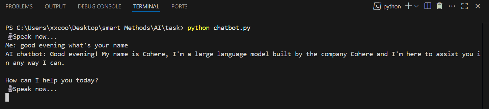

# 🧠 English Voice Chatbot using Cohere

This is a real-time **voice-based chatbot** built in Python that listens to your speech 🎙️, sends the text to **Cohere's AI model**, and reads out the response using **text-to-speech** 🔊.  
Everything happens in English — from speech recognition to AI response to spoken output.
<p align="center">
  
</p>
---
<p align="center">
  
</p>
## 📦 Required Libraries

To run this project, install the following Python libraries:

```bash
pip install cohere speechrecognition pyttsx3 pyaudio
```
---
## Full Python Code
```
import speech_recognition as sr
import pyttsx3
import cohere

# Cohere API 
co = cohere.Client("here is where you put the API key from cohere ")

# Text-to-Speech 
def speak(text):
    engine = pyttsx3.init()
    voices = engine.getProperty('voices')

   
    for voice in voices:
        if "Zira" in voice.name:
            engine.setProperty('voice', voice.id)
            break

    engine.setProperty('rate', 190)  
    print("AI chatbot:", text)
    engine.say(text)
    engine.runAndWait()


def listen():
    recognizer = sr.Recognizer()
    mic = sr.Microphone()

    with mic as source:
        recognizer.adjust_for_ambient_noise(source)
        print("🎙️ Speak now...")
        audio = recognizer.listen(source)

    try:
        text = recognizer.recognize_google(audio, language="en-US")
        print("Me:", text)
        return text
    except sr.UnknownValueError:
        print("❌ Sorry, I didn't understand.")
        return ""
    except sr.RequestError:
        print("⚠️ Speech recognition service is down.")
        return ""


def ask_ai(prompt):
    response = co.generate(
        model="command-xlarge",
        prompt=prompt,
        max_tokens=300,
        temperature=0.7
    )
    return response.generations[0].text.strip()

while True:
    user_input = listen()
    if not user_input.strip():
        continue
    reply = ask_ai(user_input)
    speak(reply)
```
